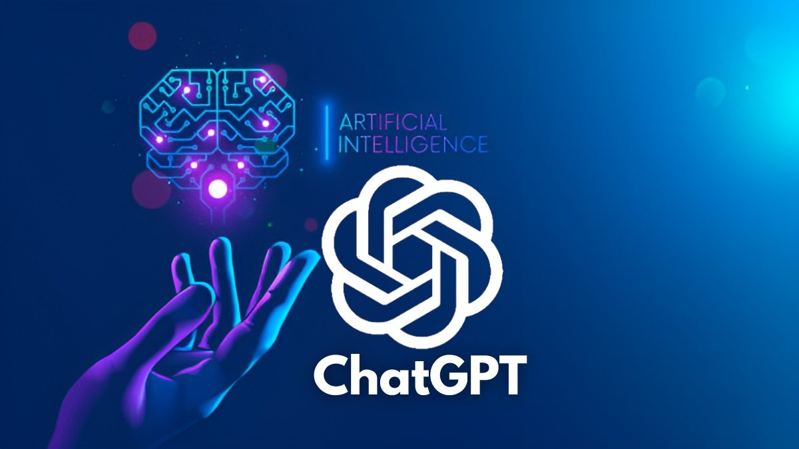

<div class="text-center p-4">


</div>

# What's the Deal with AI?
Artificial Intelligence is revolutionizing education by enhancing how students learn, educators teach, and institutions operate. From personalized learning experiences to intelligent tutoring systems, AI tools enable more efficient, adaptive, and engaging learning environments. These advancements are particularly significant in technical fields like Software Engineering, where the demand for up-to-date knowledge, problem-solving skills, and real-world application is ever-growing. In Software Engineering education, AI plays a critical role in bridging the gap between theoretical knowledge and practical expertise. Intelligent coding assistants, automated code review systems, and AI-driven project feedback tools enable learners to experiment and refine their skills in real-time. Furthermore, AI facilitates curriculum personalization by identifying individual learning gaps and recommending targeted resources, helping students grasp complex concepts more effectively. By integrating AI into Software Engineering education, institutions can better prepare students to meet the challenges of a rapidly evolving industry. As AI continues to shape how knowledge is delivered and consumed, its relevance to Software Engineering education highlights the transformative potential of combining cutting-edge technology with human creativity and innovation. In the course of ICS 314, I have made use of ChatGPT as well as Github Co-Pilot in order to teach myself concepts, become familiar with syntax, and many other uses as I treat AI as a learning tool, especially when in reverse classroom settings in which you must teach yourself the content of the course.

# Personal Experience with AI
During the experience WODs, I used AI sparingly. These assignments often involved trying new concepts for the first time after learning about them. I aimed to limit my reliance on AI to test my understanding, turning to it only when I was genuinely stuck after multiple attempts and unable to identify my mistakes. Similarly, for in-practice WODs, I avoided using AI to provide complete solutions. Instead, I pushed as far as I could on my own, seeking AI assistance only for specific clarification when truly necessary. For in-class WODs, my approach was similar, though I prioritized referencing previous practice WODs and class materials. Since these exercises were often timed, AI served as a last resort for problems I couldn’t resolve independently.

For essays, I never used AI. I believe essays are an opportunity to share personal thoughts and opinions authentically. Relying on AI to write about personal experiences or challenges undermines the integrity of the work. Additionally, being able to articulate thoughts effectively is an essential skill, not just in computer science but in life, which is why I avoided using AI in my writing.

During the final project, I used AI more frequently due to the unique challenges it presented. My group’s early start, driven by our participation in the Hawaii Annual Code Challenge, meant we encountered concepts and tasks not covered in class. ChatGPT was particularly helpful for addressing questions outside the course scope and pace. Since the software engineering class at the University of Hawaii at Mānoa follows a flipped classroom structure, where learning is self-directed, there were times when course materials didn’t fully clarify a concept. In such cases, I turned to AI for broader explanations or specific guidance.

I didn’t interact much with the ICS 314 Discord and never used AI to answer or ask questions there. However, when self-teaching, I relied on AI for coding examples and explanations of code segments not covered in the course materials. For instance, while adding text animations to the final project, I asked AI about concepts like the `easing` property in a specific animation snippet:

```
.add({
  targets: '.ml11 .line',
  scaleY: [0, 1],
  opacity: [0.5, 1],
  easing: 'easeOutExpo',
  duration: 1000,
})
```
Occasionally, ChatGPT generated code in response to my questions, but I never used it to write code without first attempting it myself. I also used GitHub Copilot to quickly resolve ESLint errors for efficiency, as these fixes didn’t directly affect the functionality of my code.

Lastly, I refrained from using AI to document my code. I believe developers should document their programs themselves, as they have the best understanding of their code's purpose and functionality. All documentation I completed for this class was written without AI assistance.

# Impact on Learning and Understanding
Using AI in educational environments can either greatly benefit or significantly hinder a student’s learning experience. In the context of this software engineering class, I would say that AI generally helped me learn, but I often felt close to becoming too reliant on it. The challenge, for me, stemmed from the structure of the class. Since it follows a flipped classroom model, students are expected to teach themselves all the concepts independently. While the provided screencasts and readings were intended to be sufficient, I struggled with them—particularly because many of the videos used a different tech stack than what we were working with in class.

These challenges led me to turn to AI as a quick and concise learning tool to grasp concepts and complete tasks on time. However, I recognize that overusing AI can negatively impact skill development and problem-solving abilities. By providing instant answers, AI can weaken the critical thinking and reflection skills that develop from spending significant time working through problems.

Throughout the course, I felt I was constantly walking a fine line in using AI as a teaching tool. With careful restraint, I believe AI enhanced my understanding of the course material, particularly given the limitations of the resources provided. However, I understand the importance of balancing its use to ensure it aids, rather than hinders, long-term learning and skill-building.

# Practical Applications
AI is more than just a learning tool in academic settings—it also has the potential to enhance user experiences across various platforms. For example, one of the challenges at the Hawaii Annual Code Challenge involved developing an AI chatbot specifically designed to provide information about Hawaii.

In a world increasingly focused on efficiency and accomplishing more in less time, an AI chatbot can be a powerful tool for users. It offers quick, insightful responses, enabling users to learn and act faster. AI bots tailored to specific topics are particularly useful for addressing niche questions that a general Google search may not answer effectively. Since these chatbots are trained on specialized knowledge, they can provide accurate and relevant answers with ease, enhancing the overall user experience.

# Challenges and Opportunities
One of the primary challenges I faced when using AI in the course was the risk of over-reliance. While AI provided quick and concise solutions, it sometimes discouraged deeper engagement with the problem. By offering ready-made answers, AI reduced the need to work through complex issues independently, which is a critical skill in software engineering. Another limitation was the occasional inaccuracy or irrelevance of AI-generated responses. For example, AI might provide code snippets or explanations that were incompatible with the specific tech stack or context of the class assignments. Additionally, AI tools often lack the ability to guide students through the reasoning behind a solution, which can leave gaps in understanding.

Despite these challenges, the integration of AI holds tremendous potential. AI can serve as a personalized tutor, providing real-time feedback and adaptive learning experiences based on a student’s strengths and weaknesses. This could help bridge gaps in understanding and supplement the flipped classroom model, especially for students who struggle with self-directed learning. Incorporating AI-driven tools for collaborative coding, debugging, and even peer assessment could further enrich the learning experience.

# Comparative Analysis
Traditional teaching methods rely heavily on lectures, textbooks, and guided problem-solving, which foster foundational understanding and emphasize hands-on practice. These methods are effective in building critical thinking and problem-solving skills over time. However, they may lack adaptability to individual learning styles and often rely on fixed pacing, which can be a challenge for both advanced learners and those who need additional support.

In contrast, AI-enhanced approaches offer significant advantages in flexibility and personalization. Tools like AI tutors or coding assistants can adapt to a student’s pace, offering targeted feedback and additional resources to address weak areas. They can also improve engagement by providing interactive, scenario-based learning experiences. However, knowledge retention may suffer if students overly depend on AI to complete tasks without fully understanding the underlying concepts. Practical skill development is another area where traditional methods excel, as they emphasize hands-on problem-solving, whereas AI can sometimes create shortcuts that bypass this critical process. A balanced approach—leveraging AI for supplemental support while maintaining the rigor of traditional methods—could provide the best of both worlds.

# Future Considerations
The future of AI in software engineering education is bright, with advancements in natural language processing, adaptive learning systems, and collaborative tools poised to reshape the landscape. AI could enable real-time curriculum customization, where course materials are dynamically adjusted to align with industry trends or individual learning needs. Virtual coding environments powered by AI could offer instant feedback, simulate real-world scenarios, and even evaluate code quality in nuanced ways that traditional grading systems cannot.

However, there are challenges to address. Ethical concerns, such as over-reliance on AI or academic dishonesty, will need proactive solutions. Ensuring that AI tools provide accurate, contextually relevant information is another critical area for improvement. Furthermore, educators will need training to integrate AI effectively into their teaching practices.

To fully realize its potential, AI integration in software engineering education should focus on enhancing, rather than replacing, traditional learning methods. By emphasizing collaboration between students, educators, and AI systems, the future of software engineering education can become more dynamic, inclusive, and effective.

# Conclusion

Overall, I believe the use of AI in the Software Engineering course provides a unique opportunity for students to reflect on their learning process. In my experience, the targeted and specific assistance AI offered was often very insightful. However, I think the course would benefit greatly from updating its readings and screencasts to align more closely with the current tech stack. Providing resources that reflect the tools and formats actively being used would give students a more consistent and relevant foundation for learning. While I noticed that some of the earlier modules included up-to-date materials, discrepancies became more apparent as the semester progressed, which left me relying more on AI due to the lack of suitable resources.

I believe allowing AI use in a course can be beneficial, but it’s important to implement measures that prevent students from becoming overly dependent on it. For instance, AI could be positioned as a supplemental tool, with mechanisms in place to encourage students to attempt solving problems independently first. Finding ways to allow AI as a helpful resource while introducing appropriate checks—such as limiting usage or tracking reliance—would help balance its benefits with the need for students to develop their problem-solving skills.

While AI holds significant value in education, particularly in enhancing learning efficiency, it’s crucial to monitor its use to ensure students are not over-reliant. Striking this balance would allow AI to support, rather than hinder, the development of critical thinking and technical skills, making it a powerful tool in courses that choose to incorporate it.