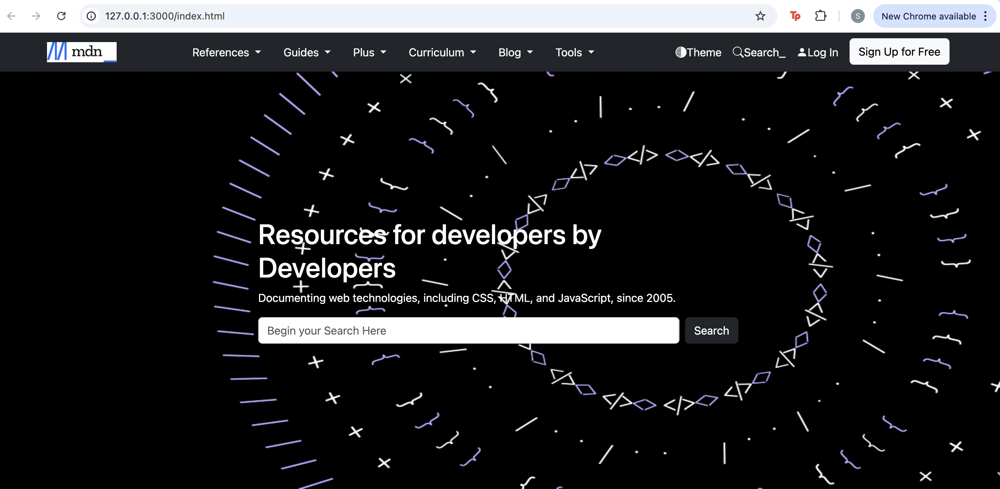
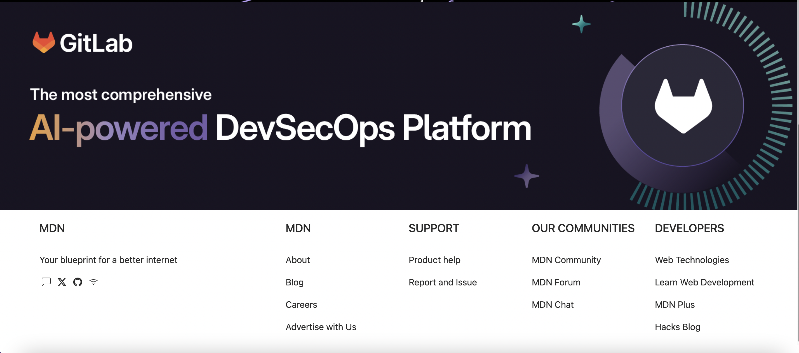

According to a data report by [Reboot](https://www.rebootonline.com/website-statistics/), as of 2024 there are about 1.14 billion websites in the world, proving that the existence and usage of websites is far spread to every corner of the world. Websites and user interfaces are things that people interact with daily.  With an example being the common experience of finding a new restaurant through your social media feed, then booking a ride on a rideshare app to get to the new spot, and leaving a review post-meal. This alone requires the use and visitation of three different UIs. UIs surround us, and the quality of a UI greatly affects the experience a user takes away from their interaction. UIs with clean, concise, and visually appealing designs tend to leave a positive impression opposed to those that are hectic and visually uninteresting. The use of frameworks is a quick and easy way to achieve an appealing UI.

## The Benefit of Bootstrap 5
So far in my coding journey, the only framework I have been exposed to is Bootstrap 5, and within the first week of becoming familiar with its structure, I can see why some may lean towards working with Bootstrap 5 and other frameworks. The first benefit of frameworks that stuck out to me was how much time you can save during development while still producing a quality product if experienced. Adding Bootstrap 5 into your default HTML code allows for easy manipulation of text, images, and other common components you would find on a website with the simple use of classes. Just call the right class at the right time and you can add a design aspect that may have taken you painstaking hours to manually implement yourself. Another benefit of using a framework is that the tools of the framework are easily replicable in different projects. All you have to do is call the link and scripts associated with that framework, and its tools are now accessible to you in any project. Overall, in my first experience of using a framework, I can see why many find it appealing. The time it can save you while not compromising quality and even enhancing the quality, dependent on your skill in HTML and CSS, demonstrate why it is a go to for many web designers. 

## The Benefit of CSS and HTML
While I am able to see the benefits of using a framework, I can also notice the weak points within its design and why some may prefer to stick with straight HTML and CSS. Within my first week of familiarizing myself with Bootstrap 5, I can say that the learning curve to get comfortable with it has been steep. There are a lot of ‘keywords’ you need to learn in order to code within a framework efficiently. As time passes and I begin to use Bootstrap 5 more, I start to feel I am getting quicker at remembering the syntax and class names that are necessary to complete the tasks I set for myself. However, in the beginning I felt like there was no time benefit of using a framework because I was so unfamiliar with the layout. The only aspect I saw improvement on was the visual quality, since I am still new to website design from scratch, and Bootstrap 5 implements website styling better than what I can currently do. Another limitation of frameworks is that you are limited in terms of customization and flexibility of what you may want to accomplish with your projects. The upside of a framework’s layout is how efficiently design aspects can be implemented, which also means your possibilities of what can be accomplished within the framework are as limited as what has already been laid out. So, if a framework seems constricting for you, using HTML and CSS lets you create with no bounds. But be warned, as implementation may take longer.

## Frameworks Lay the Framework
Currently where I stand as a coder, I prefer using a framework since I know my design skills as well as my HMTL and CSS skills are not to the point where I need total creative liberty. My primary interests within computer science are data science and data visualization, so truth be told, I’m not sure if my web development skills will ever get to a point where using no framework is more beneficial to me and my projects. However, going through this experience of UI design, web development, and coding using frameworks, HMTL, and CSS has allowed me to gain a deeper appreciation for those who do specialize within this part of the field. I can confidently say that after being exposed to the Bootstrap 5 framework, I feel I could make my own websites in a way that is appealing to the users. So far, I’ve already practiced using Bootstrap 5 to replicate numerous professional websites of different companies, albeit mines are not quite as refined as those I modeled my practice runs after. However, in my perspective, they look visually appealing enough to properly display any of my future projects I wish to share with the world. 

In conclusion, I understand the limitations and frustrations web developers have when it comes to frameworks. However, to many computer scientists, such as myself, who may not specialize in web development but still want a sleek, customized way of showing off their work, frameworks offer a solid foundation to create the necessary website. And with that I say, I am a fan of frameworks. 

