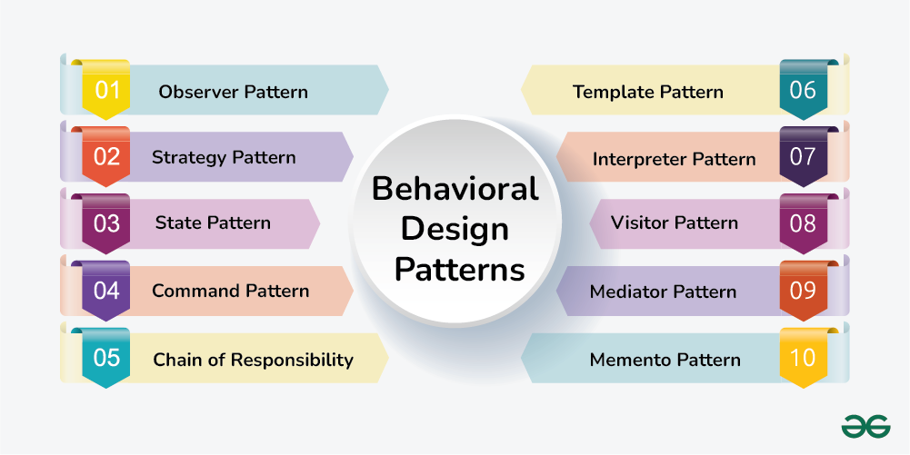

# Designing a Solution
Have you ever been working on a project and come across a problem that makes you say,
*“Man, I really wish someone already had the solution to this issue, so I don’t have to figure it out from scratch?”.*
I know I have. There have been multiple times throughout my computer science career where I am working on a project, I run into a problem and am hoping that out of the vast sea of intelligent computer scientists, one has run into a similar issue and found a solution I can adapt. Luckily, design patterns are just the solution to this conundrum many coders face. To be more explicit, design patterns are flexible solutions to common problems that can be reused and adapted to the correlating circumstance. They are more so templates to a solution, rather than the exact solution for your specific problem. A highlighted trait in design pattern is the adaptability and reusability of these blueprints that let them remain timeless.

As I reflect on some of the projects I have worked on up until this point in my computer science career, I can recall a few instances where I utilized common design patterns to solve a problem I was working on.

# Observe and Execute
In my undergraduate studies, I have had the opportunity to work under the Office of Indigenous Knowledge and Innovation as a fellow in the Indigenous Data Hub Fellowship program. While in this fellowship, I have been tasked to help in the research and development of creating a UI that displays sinkhole agriculture data that is collected by community partners. One of the features I worked on implementing was a comparison feature which would be toggled based on different durations of pressing and holding a data entry’s button. The pattern we wanted to happen consisted of:

1. The user wants to toggle the comparison feature between two different data entries on.
2. To do this, they must perform a long hold on one of the data entries they wish to compare. This will lock that data entry to one side of the screen.
3. All other data entries need to be listening for a quick tap on their corresponding button. This quick tap is what tells the data entry to go on the other side of the screen (opposite from the data entry that is locked) and be displayed there for comparison.

This implementation required that the data entry tables, which were the observers in this case, needed to be informed about the change of status of the data entry buttons, which were the subjects. This is one example of how the observer design pattern was practiced in this project, however it was applied many more times for other features, such as a cultural component sidebar and a sinkhole location toggle feature, just to name a few.

# The Dark Side of Design Patterns
While I have been fortunate enough to have positive experiences and practices with design patterns, I must also admit I am not immune to negative design patterns that can cause more harm than good. That’s right, I am talking about the dreaded anti-pattern. An anti-pattern is a design pattern that is considered ineffective and unproductive when trying to solve a reoccurring issue. An example of this is when there are pieces of code that are left in the codebase in the chance that it might be used later, but it is never turned on, thus clogging the code base. Similarly, there is the lava flow problem, where old code is never touched or improved upon out of fear of breaking the whole system. The set back to this problem is that no one fully understands that section of old code, thus leaving old code hard and untouched like a lava rock. I have fallen victim to these poor habits before in previous projects, however being aware of the inefficiency and negative impact they leave on projects has made me more aware of how to prevent falling into them in future projects. Design patterns are important frameworks computer scientists need to familiarize themselves with to efficiently problem solve during development. Not only is it beneficial to understand the positive design patterns and how to apply them, but it is also important to familiarize yourself with negative design patterns so you can prevent yourself from falling into those bad habits.
