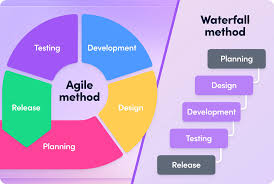
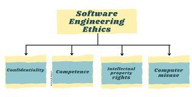
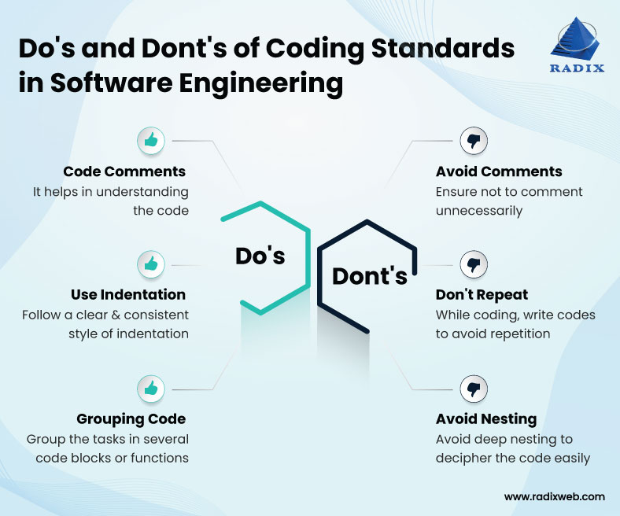
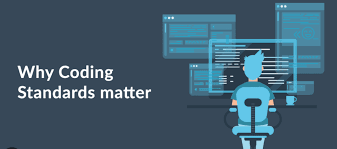

Throughout this Software Engineering course, I have gained many valuable skills as the weeks progressed. From learning new technical skills tied to an unfamiliar tech stack to grasping broader concepts applicable across various fields in computer science, the class has provided a well-rounded experience. While I don’t envision myself working on web applications in my career, as I am more drawn to data-driven applications, I can still see how the topics covered in this course can be adapted and applied to different scenarios. Specifically, the concepts of Agile Project Management, Ethics in Software Engineering, and Coding Standards stand out as lessons I intend to carry forward.

# Agile Project Management

Agile project management is an iterative approach to planning and executing projects. It breaks down the project process into smaller, manageable sprints or iterations, allowing teams to make steady progress. In ICS 314, we practiced **Issue-Driven Project Management**, a specific form of agile project management. This approach centers around identifying issues that need solutions, creating high-quality fixes, and repeating the cycle to advance the project. Each team member is assigned specific issues to resolve, and their work is carried out on individual branches, which are then merged into the main branch after completion.

Through the final project in this course, I became familiar with Agile and Issue-Driven Project Management, and I have already applied these techniques to other computer science projects unrelated to web development. For example, in my research position, I work on a data visualization interface and data collection system for sinkhole data. This project follows an iterative approach, where we continuously seek system improvements. By adopting Issue-Driven Project Management, I have been able to break down larger tasks into smaller, actionable items, ensuring steady progress. This method has made achieving overarching goals feel more manageable and realistic. I value how this approach allows for clear task organization and incremental development, making complex projects more approachable.

# Ethics in Software Engineering

Ethics can be defined as the *“moral principles that govern a person’s behavior or the conducting of an activity.”* In the realm of computer science, ethics plays a crucial role as it serves as the foundation for ensuring that technology is developed and utilized in ways that are fair, responsible, and safe for society. The influence of code is pervasive—it underpins fundamental structures that shape our daily lives. From the software that powers the cars we drive, to the computers we use in the office, to the phones we rely on for communication and relaxation, technology is deeply intertwined with our existence. The code embedded within these technologies has the potential to significantly impact people’s lives, making ethical considerations critical in preventing harm and ensuring positive societal outcomes.

Without ethical principles guiding its development, technology risks becoming a tool for corruption, exploitation, or harm, potentially degrading the quality of life for innocent individuals. Ethical lapses in areas like data privacy, algorithmic bias, or cybersecurity can lead to serious consequences, such as breaches of personal information, unequal treatment, or malicious misuse of software. By embedding ethics into the practice of computer science, developers can help mitigate these risks and uphold the trust placed in technology.

As I move forward in my career, ethics in computer science is a principle I will carry with me. In my anticipated pursuit of data science and data analysis, I recognize that I will likely work with sensitive data at some point. How I handle this data, the decisions I make regarding its use, and the potential consequences of those decisions on individuals and communities will require careful ethical consideration. I must weigh the implications of my actions, ensuring that I prioritize fairness, privacy, and transparency. Understanding the impact my work may have on others will remain a guiding principle as I strive to contribute to a future where technology benefits, rather than harms, society.

# Coding Standards

Coding standards are widely accepted guidelines that promote readable, maintainable, and consistent code. These standards provide structure and organization, making it easier for others to understand and work with the code in the future. I often think of coding standards as the grammar of programming—while technically optional, their absence makes communication confusing and prone to misinterpretation.

In ICS 314, we used **ESLint** to enforce coding standards. This tool helped ensure that our code followed best practices and remained consistent across team projects. Moving forward, I intend to continue adhering to coding standards in all my future projects because I see their immense value. When writing code, it’s easy to overlook the importance of structure and clarity, as the developer inherently understands how all parts of the system interact. However, coding is a collaborative process, and it’s essential to consider how others will interpret and build upon your work. By following coding standards, I can contribute to creating a more seamless and efficient development experience for myself and my peers.

