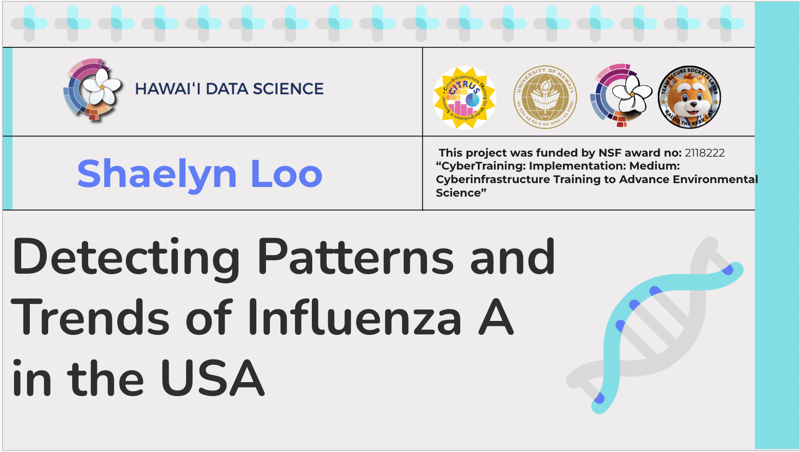
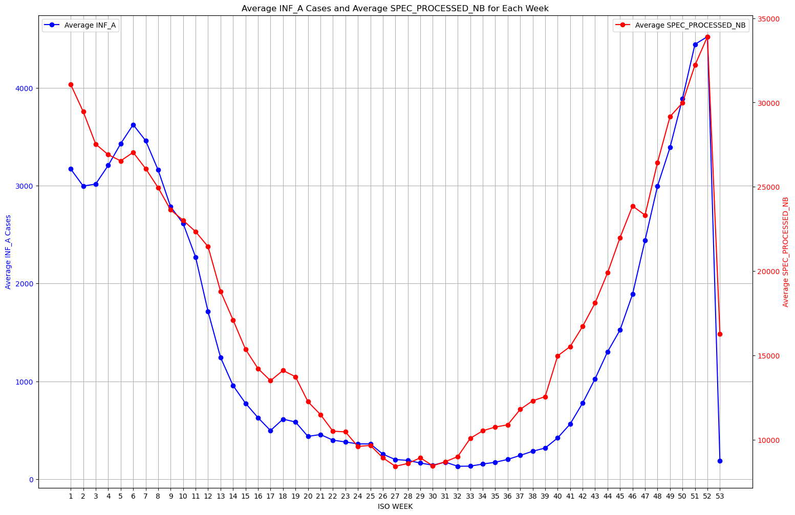
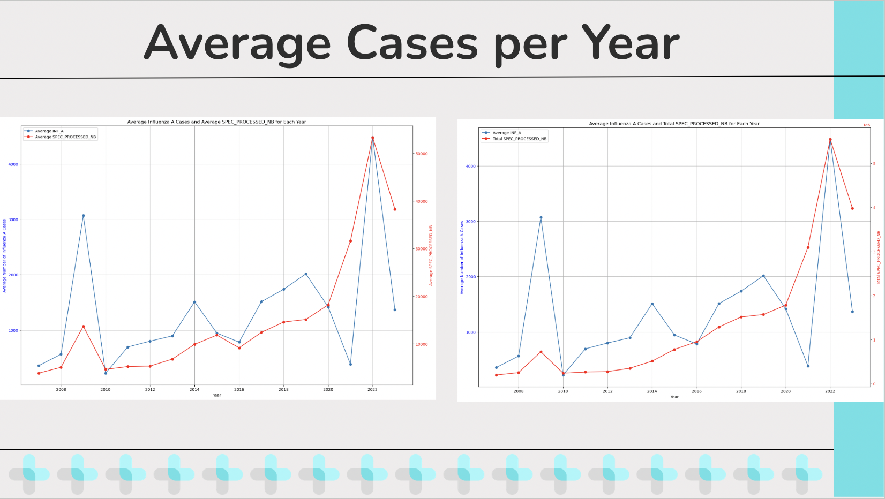
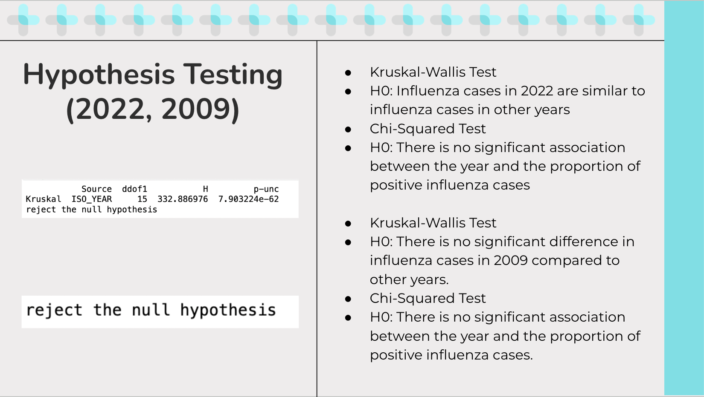
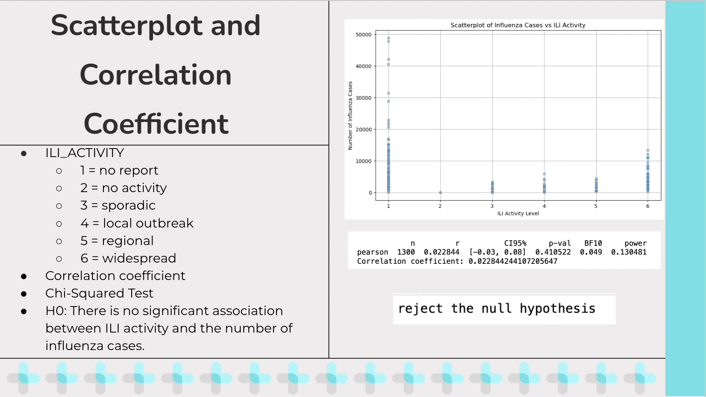

# Project Overview

  
  

My project, Detecting Patterns and Trends of Influenza A in the USA, was developed under the mentorship of the CyberInfrastructure TRaining for Undergraduates in Summer (CITRUS) program at the University of Hawaii. CITRUS is a research opportunity in a REU-style immersion to develop skills in CyberInfrastructure with a climate-based research project. The program entailed learning and developing data science skills which would then be applied as each mentee carried out their own research project surrounding a topic and data set of their choosing.

My topic focused on the intermingling of health and climate which led me towards wanting to apply data science techniques to identify patterns and trends of Influenza A in the USA. The research question I based my findings around was, “Are there any consistent patterns in the timing and intensity of influenza A seasons?”. I was able to find a dataset from the World Health Organization which had data on Influenza A cases in the USA from 1997 to 2024. I then cleaned the data, which included dropping columns and rows that were not relevant to this research question and filling in missing values.

# Average Cases per Week and Year

  
  

One of my first steps of analysis was looking at the average cases per week across all the years I was looking at. I did this with the goal of wanting to answer the question of if generally there were patterns in the timing and intensity of Influenza A throughout the year. I took the mean as my measurement for this because I figure it is a good frame of reference when finding seasonality detection and intensity patterns. As you can see from the graph on the left, the blue line shows the average influenza rate for the corresponding week and the red line shows the average specimens processed for that week as a gauge of the sample size these results were gathered from. Visually we can see there does seem to be a pattern when it comes to intensity of the number of cases. There is a spike in cases during the earlier weeks and later weeks of the year, and dropping drastically for the middle weeks of the year, showing that influenza cases seem to be larger around the winter months.

Another thing that I graphed for analysis is the Average cases of influenza per year. I graphed the Average cases of influenza per year both against the Average specimens processed per year as well as the total specimens processed per year, largely because I was curious at how they would differ. And as we can see there is a notable difference between plotting the two, specifically in scale and purpose. A benefit about comparing Average cases of influenza per year both against the Average specimens processed per year is that it allows a normalization of the data since it is taking averages from both values. It also allows for a proportional relationship between the samples processed and cases detected which allow for a better insight on testing accuracy or effectiveness. Meanwhile comparing  Average specimens processed per year and total specimens processed per year provides an insight to total volume of samples processed and tested per year which allows for a better understanding of scaling efforts and offers context and understanding regarding the scope of the testing and its relation to the samples. Now one thing I want to point out regarding the Average Influenza A cases per year if that visually, we can easily see two outlier years that seem to have a much higher spike than the other years, specifically 2009 and 2022. And I wanted to bring attention to these two years for the hypothesis testing I tried doing regarding these outliers.

# Hypothesis Testing, Scatterplot, and Correlation Coefficient

  
  

 

The first test I ran was to do hypothesis testing in the year 2022. The hypothesis I was testing was “Influenza cases in 2022 are similar to influenza cases in other years”. I ran a Kruskal-Wallis Test since I thought it may be the best fit test based on my understanding of it. Since I am comparing one year, 2022, to multiple other years and the data is not normally distributed, this test can handle multiple groups and can work without the assumption of normality. The results I got after running the test is to reject the null hypothesis, meaning there is a significant difference in the influenza cases in 2022 compared to other years. After that was confirmed I ran a Chi-squared test to test the hypothesis, “There is no significant association between the year and the proportion of positive influenza cases” because I was curious to see if the reason of the spike had anything to do with because a larger sample was taken of people so more cases came out positive. The reason I choose a chi-squared test for independence is because from my understanding, it can test if there is a significant association between the year and the proportion of positive influenza cases. The Chi-squared test lets us figure out if there is a statistically significant association between the year and the proportion of positive influenza cases which helps assess whether the spike in 2022 can be due to a larger number of specimens processed or if there is another factor. The result is to reject the null hypothesis, meaning there is a significant association between the year and the proportion of positive influenza cases. A similar test was run for 2009, concluding the same results.

ILI_Activity stands for Influenza-Like Illness Activity which is a measure used by public health organizations to describe the spread and intensity of influenza-like illnesses in a population. The values I got from the excel sheet were numeric and encoded to mean…
I created a scatter plot trying to show the relationship between influenza cases and the Influenza-Like Illness Activity and wanted to calculate a correlation coefficient between the two. After running for a correlation coefficient, I got a value of around 0.02 which means there is a very weak correlation between Influenza-Like Illness Activity and Influenza A cases. From running this test I also got a p value of 0.410 which tells us that there is not enough to confidently claim an association between influenza-like illnesses and influenza cases. A concern that begin to arise for me is that the correlation coefficient wasn’t a good measure for what I was testing since ILI_Activity is an ordinal variable while standard correlation coefficients are for continuous variables, which is why I then decided to run a Chi-squared test to see if there is a significant association between the distribution of influenza cases and ILI_ACTIVITY levels. The initial hypothesis is “There is no significant association between ILI activity and the number of influenza cases”. The results were to reject the null hypothesis, meaning there is a significant association between ILI activity and the number of influenza cases.

# CITRUS Takeaways

This project was completed by myself with the guidance of my graduate mentors that would be done through daily check-ins to see the progress of my research project. It gave me an opportunity to refine my data science coding skills and gave me an opportunity to apply research techniques. To be eligible to participate in this program I had to acquire a CITI conduct of research certificate that shows I understand the ethics behind researching. This program also let me develop my communication skills which were necessary when it came to sharing my findings through a final presentation conducted at the end of the program.

To see more of my code, you can click [here](https://github.com/shaelyn-l/CITRUS-2024.git) to go to the project repository.

For more information regarding this project, you can see my final presentation on this project [here](https://docs.google.com/presentation/d/1tGAJVMcuSHLmi7Si2j87I2ENSzEC9S1xj7CoL6TqFCM/edit?usp=sharing).

