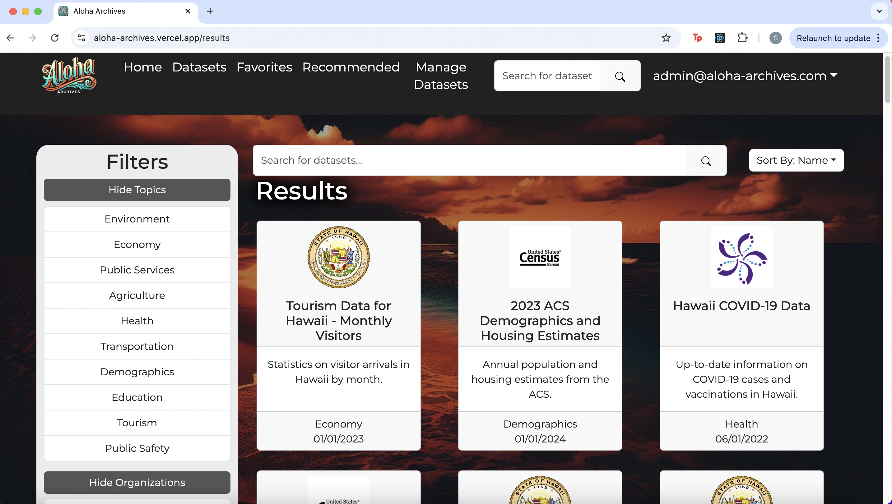

# All About Aloha Archives
## How did it Begin?
Aloha Archives was a project originally constructed as a result of taking ICS 314, Software Engineering, the same time as the 2024 Hawaiʻi Annual Code Challenge was being hosted. One of the challenges presented for coders to take on was the [**Citizen Portal on Open Data**](https://hacc.hawaii.gov/wp-content/uploads/2024/10/ETS-Data-Challenge_2024.pdf) challenge presented by ETS. This challenge consisted of designing a new citizen portal to replace the current one in order to accommodate more citizens and their needs. Suggested solutions to this challenge largely consisted of creating and identifying citizen personas to make looking for appropriate datasets easier, as well as providing a means of data visualization to make understanding the data more accessible to those who may lack technical skills to process the data themselves. Overall, the focus of the challenge was to take the Hawaiʻi Open Data page and make it more user friendly for a diverse audience and not just data scientists or analysts.

At the same time this challenge was being proposed for the public to partake in, I was enrolled in Software Engineering at the University of Hawaiʻi at Mānoa. This class offers the option to get extra credit if you participate in the Hawaiʻi Annual Code Challenge and make it to the finals. Even if you do not make it to the finals, it is possible to use your project you made for the challenge as a final project for the class, provided you use the correct tech stack and project management model. It was this combination of timing and opportunity that led me and a team of three others to create Aloha Archives, a project meant to tackle the ETS Citizen Portal Challenge.

## What are the Features?

Aloha Archives is an open data portal designed with the intent to be easily accessible and digestible to various demographics of people. When logging onto the website, you are met with search options to explore the datasets listed on the website, as well as presented the top trending datasets. After exploring through the datasets and finding one of interest, you can click on the dataset card which expands into a page with details about the dataset. Along with the expanded information, you are able to use the visualization tool at the bottom to generate graphs of the dataset. If you have an account and are logged in, you have the ability to favorite a dataset for easy reference. You are also able to take a persona quiz and be recommended specific datasets in relation to your assigned persona. If you are an admin user, you are given the option to manage datasets by adding, deleting, or editing the database from your account.

# Personal Contrubutions

## Milestone 1
The development of this project was done in three stages. Each stage built on the progress of the previous stage in order to make improvements towards the final product. The first stage we focused on the appearance of the website. Specifically, we wanted to get the skeleton of the website layed out, not necessarily focusing on function yet. In this stage, I focused on refining the navigation bar in the context of our web application. This included navigation bar styling, adding tabs related to our website, and creating some of the contents of these pages, such as the terms of use page.

## Milestone 2
In the second stage, our focus was to get baseline functionality down, in essence, get all key features of the website to work in their most simple forms. As mentioned in the description of this project, something the challenge author was looking for was the ability to identify a user's persona and use that information to enhance the user's experience. I came up with the idea to create a “persona quiz” in which the user can fill out a short questionnaire on what their data needs are and be assigned a persona based on their result. Using this result, different datasets related to the personas would be suggested to the user. I made the persona quiz page, the quiz itself, and created it to write the user's result to the database where it can be referenced. I also created it so it can be retaken multiple times and updated, since the user and their data desires may change over time. With more functioning pages popping up in this implementation stage, I also managed the navigation bar and what functionalities are available to a user based on their role (ie. admin or regular user) and implemented a feedback form on the website. Lastly, I also added an animation aspect to the homepage of our website.

## Milestone 3
During the final stage of the project, the main focus was to fully flush out the basic functions we had made a baseline for in the previous stage, as well as to add on any final touches to make our application complete. In this implementation round, I worked on making metadata from the database viewable to admin users, updated the “My Profile” page so that users are able to access different features of the website through that tab, as well as add an “Edit Datasets” page for admin users to access. This page reads and writes to the database, allowing admin users to modify the dataset in the database from the Aloha Archives website. I also did all the documentation and management of our project home page and ReadMe over the course of this project.

# Takeaways from Aloha Archives
As mentioned before, the basis of this project was a result of being able to kill two birds with one stone. My team and I get to experience and participate in the Hawaii Annual Code Challenge (HACC), possibly earn extra credit as a result of that, and we can use the work we’ve completed over the course of the HACC as a final project for ICS 314. With that being said, participating in the HACC and using the HACC timeline and project frameworks to create Aloha Archives has truly taught me a lot. I think one of the most beneficial skills I got out of this experience was learning how to do group work on coding projects. Prior to this experience, I was familiar with how to do collaborative group work, however, I had never collaborated on code. The experience of using github, following Issue Driven Project Management, and being able to code in parallel with your peers was a new experience for me, but an extremely useful one to get used to. I understand that in the real world, almost all code is done collaboratively, therefore, being able to experience it for the first time through the scope of Aloha Archives was an amazing learning experience. I also appreciated being able to work on such a large project in terms of file and folders. A lot of the code I had done up until this point was completed across the span of only a few files at most. However, creating Aloha Archives required multiple folders, files, and interactions with other applications outside of VSCode in order to get the project to be function (eg. working with databases in PostgreSQL), thus making the project a fairly large one. I appreciated that experience because I understand in real life, applications are very large and comprehensive, so being able to get familiar with large projects through Aloha Archives was very beneficial. 
I also liked how this project challenged me to become very familiar with the tech stack necessary for completing this project. When you know what you want to aim for, a tech stack that you are told is enough to get the job done, and a time limit, you learn how to learn on your own very quickly. I was already familiar with aspects of parts of our tech stack, so using what I already knew plus online resources, I was able to figure out what concepts to apply and where in order to finish each of my tasks.

## Hawaiʻi Annual Code Challenge 2024

Aside from all the technical skills I gained over the course of creating Aloha Archives, I was also able to gain an amazing experience through competing in the HACC. Our team, ICS 3+1=4 was fortunate to be selected as one of the teams who got to present our project in the finals. Out of around 40 teams who entered to compete that year, we were one of the 18 selected to do final presentations and in the top 9 for the collegiate category. While we did not go home as one of the winners of our category, the experience of being selected and sharing our project with the judges and audience is one I will never forget. I felt immensely proud of the fact that we joined the competition with no real expectations set for us, but at the end of it, I was able to present a live demo and share a project that we had all put a lot of time and effort into. Aloha Archives is a project that has been very enriching and fulfilling to me, and for that I will always aloha it.

If you would like to see the live demo I did during the final round of the Hawaiʻi Annual Code Challenge, click [**here**](https://youtu.be/2zqgOHvcVZU).