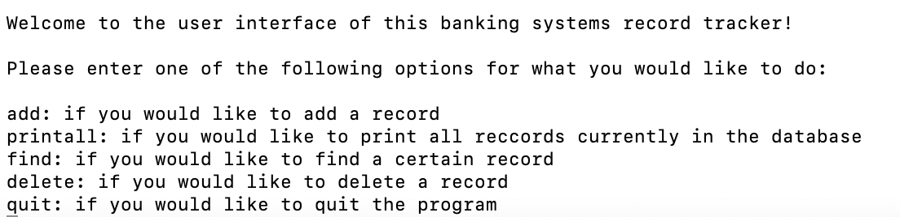

This project simulates a banking system record tracker that I developed in my ICS 212 class. When run, the program prompts the user with a welcome message, giving the rundown of how the user can interact with the system. You can add, delete, or find a specific record or you can print all the records entered in the database so far. There is also an option to quit the program and if the user exits and decides to rerun the executable, all records will be remembered from the prior run. The program tells the user that they are able to access any of these commands by entering specific keywords, however, the code also allows a command to be called if a command is only partially entered. For example, if the user wants to select the ‘find’ option but only enters ‘fi’, the command will still run and all the necessary follow up questions will execute. 

This project was coded across multiple files for the interface and database which demonstrates the skill of being able to link files together to create a cohesive end result. The linking of the files taught me the importance of modularity when it comes to working on large projects. While this project was completed by myself alone, during the implementation period, my professor stressed the importance of keeping the files for the UI separate from the backend work being done. This was because when working on larger projects in a team, we were taught that being able to separate areas of the program makes it easier to debug and read when files are put together. I was also taught the importance of creating readable code and utilizing comments so it becomes easy for other people to follow what is being programmed. I also learned about UI design aspects to consider when creating an interface. While this project was originally coded in C, I also redid it with the same premise and requirements in C++ to demonstrate competence in both languages.

To see my project done in C, click [here](https://github.com/shaelyn-l/bank-C.git).
To see my project done in C++, click [here](https://github.com/shaelyn-l/bank-C-.git).
