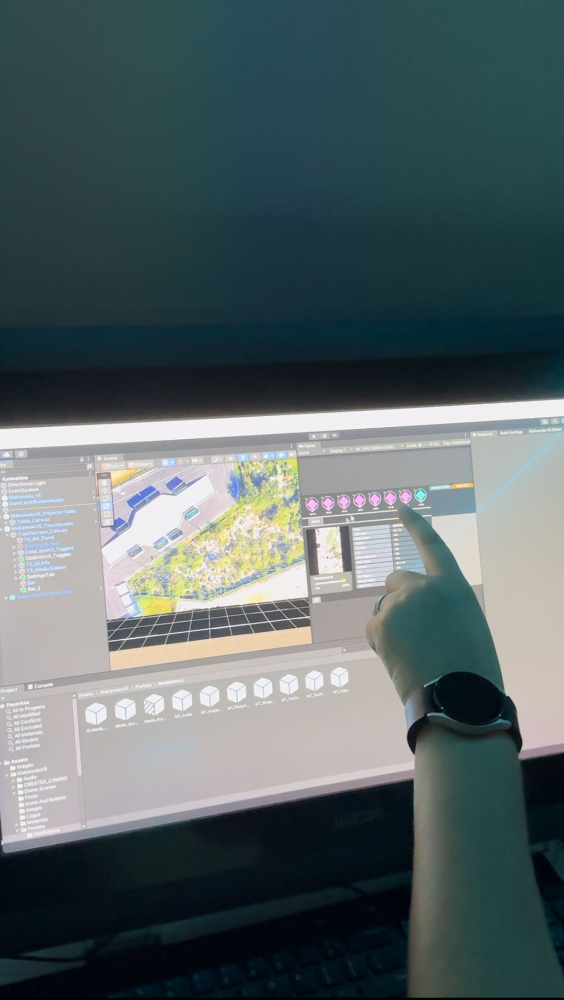
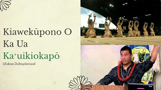

  
  

The Office of Indigenous Knowledge and Innovation at the University of Hawaii has a fellowship program where each of the fellows gets partnered with a faculty member or community partner to develop an application that combines technology development and indigenous practices. The program is based out of the Create(X) Lab at the University of Hawaii at West Oahu campus, whose sister lab is the LAVA Lab at the University of Hawaii at Manoa. 

Starting in January of 2024, I was accepted into the program and paired with community member, Ulukoa Duhaylonsod, who has been a part of restoring a Hawaiian historical site that was once used for sinkhole agriculture. The program has partnered with Ulukoa to gain understanding of this area and the practice that comes with it, in order to develop a project that can be used for presentations to educate others as well as raise awareness and funding for the sinkhole site. Using the Makawalu VE developed in the LAVA Lab, we are able to modify the template provided and reframe it to fit the scope of this project. The goal is to create a touchscreen UI that works in tandem with wall and table projectors to display data regarding the sinkholes for easy presentation. The program uses the third party app, Epicollect5, for Ulukoa and others to use when collecting data in the field. This can then be exported as a json file which can be uploaded into the project for the corresponding data points to then be displayed. This is a project being continuously worked on with multiple iterations in development.

I am one of the co-designers and co-coders to this project along with my mentor Kari Noe. I have been involved in the design and development for this project which includes: going out into the field to discuss effective design implementations with those who will use this application, drafting multiple possible designs for data visualization, adjusting and adding to the the Makawalu VE code, and logging design notes as the project progresses. Some of the key skills I have gained from this project so far are UI/UX design, iterative and equitable design, project documentation, and familiarity with C# and Unity.

## Public Highlights and Media Features
Click [here](https://www.hawaii.edu/news/2024/09/30/student-projects-indigenous-contemporary-sciences/) to read an article about the fellowship program I am apart of.

Watch my Presentation on the first iteration of the Sinkhole Visualization Project below:

Click [here](https://www.youtube.com/watch?v=UZyeq6Qis48) to see my interview with Hawaii News Now.
